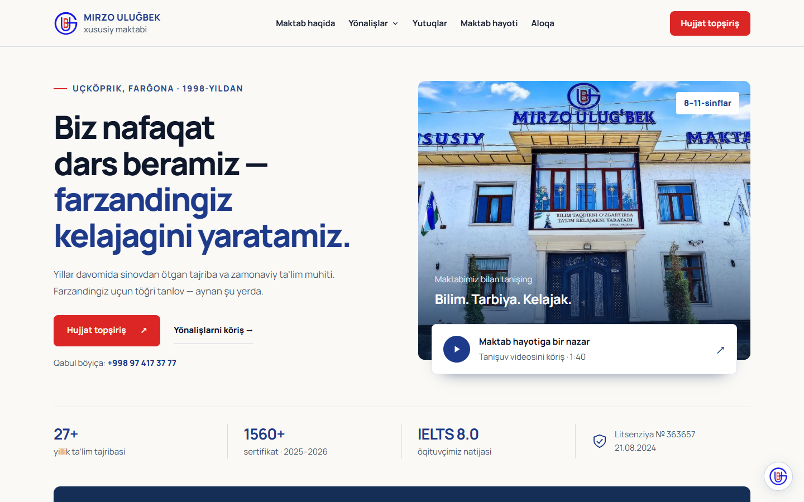

# Egasiga hisobot — bosh sahifa v3

**Sana:** 2026-09-28

**Branch:** `chatgpt/maktab-astra6`

**Asos:** `claude/logistics-site-animation-comparison-r4scvk`, `229ea27`

Ish agent/subagentsiz bajarildi. O’zgarishlar faqat `maktab/` ichida.

## Natija

Bosh sahifa oq/iliq fon, to’q ko’k sarlavhalar, qizil asosiy tugmalar va lokal Manrope shriftiga moslandi. Haqiqiy bino surati birinchi ekranga chiqdi; katta video alohida boshqariladigan oynada ochiladi. Chalg’ituvchi animatsiyalar va sahifani ushlab turadigan gorizontal scroll olib tashlandi.

Qo’shildi:
- yo’nalishlarni maqsad bo’yicha saralash;
- surat va sertifikatlarni kattalashtirib ko’rish, sertifikat almashishini to’xtatish;
- savollar ichidan ikkala o’zbek alifbosida qidirish;
- manzil, ish vaqti, telefon va xarita bilan **Maktabga tashrif** bo’limi;
- klaviatura bilan boshqariladigan menyu va modallar, aniq fokus, mazmunga o’tish havolasi;
- Ş, Ç, Ö, Ğ va ’ uchun umumiy build/runtime transliteratsiyasi.

Ariza, chat, tashrif va qo’ng’iroq API kontraktlari saqlandi. Formada +998 bilan nusxalangan telefon to’g’ri qabul qilinadi. Serverga viloyat/sinf asl qiymatda yuboriladi; kiritilgan ism va chat xabari o’zgartirilmaydi.

## Ko’rish uchun skrinshotlar

| Ko’rinish | Fayl |
|---|---|
| Desktop bosh ekran | [desktop-home.png](review/desktop-home.png) |
| 390 px mobil bosh ekran | [mobile-home.png](review/mobile-home.png) |
| Yo’nalishlar | [desktop-directions.png](review/desktop-directions.png) |
| Mobil ariza | [mobile-form.png](review/mobile-form.png) |
| Haqiqiy maktab suratlari | [desktop-life.png](review/desktop-life.png) |
| Yangi tashrif bo’limi | [desktop-visit.png](review/desktop-visit.png) |
| Original video ijrosi | [desktop-video.png](review/desktop-video.png) |



## QA natijalari

| Tekshiruv | Qamrov | Natija |
|---|---|---|
| To’liq sahifa | 1440×900, 390×844; 62 skrinshot | Konsol xatosi 0; gorizontal overflow 0; mobil’da 15 px dan kichik matn 0 |
| Reduced-motion | Ikkala o’lcham; 12 skrinshot | Kontent ko’rinadi; konsol/overflow/kichik matn xatosi 0 |
| Haqiqiy tashqi media | GCS sertifikatlari va Telegram rasmlari; 4 skrinshot | Haqiqiy rasmlar yuklandi; konsol/overflow/kichik matn xatosi 0 |
| Funksional | 21 tekshiruv; Edge | **21/21 o’tdi**; video kamida 3 soniya haqiqiy ijro etdi |
| Moslashuv | 320, 390, 768, 1100, 1440 px | Hujjat gorizontal overflow’i 0 |
| Release auditi | 3 inline JS bloki, matn va resurslar | JS sintaksisi to’g’ri; tashqi script 0; eski alifboda qolgan statik matn tuguni 0 |
| Fayllar | `index.html` va `dist/index.html` | SHA-256 aynan bir xil |

Funksional qamrov: asosiy faktlar va bir dona H1/main; alifbo va xom API qiymatlari; menyu fokus/Escape/anchor; yo’nalish filtri; sertifikat filtri/klaviatura/pauza/katta rasm; galereya; FAQ qidiruvi; formaning bo’sh/to’g’ri/duplicate/400/429 holatlari va 60 soniyalik reload cheklovi; chat history/session/fokus; tashrifning sessiyada bir marta sanalishi va tanasiz track-call; faqat yangi yangilikni qabul qilish va rasm hosti tekshiruvi; video ochish/yopish; turli ekran kengliklari.

**Barcha API testlari lokal mock bilan. Jonli /api/ariza ga sinov yuborilmadi.** Funksional hisobotdagi ikkita HTTP 400/429 konsol yozuvi ataylab modellashtirilgan javoblardan keladi; JavaScript runtime xatosi yo’q. Odatiy vizual QA va haqiqiy media tekshiruvlarida konsol yozuvlari bo’sh.

Mashina o’qiydigan hisobotlar:
- [To’liq sahifa](review/full-report.json)
- [Reduced-motion](review/reduced-report.json)
- [Haqiqiy media](review/live-media-report.json)
- [21 funksional tekshiruv](review/functional-report.json)
- [Release auditi](review/release-audit.json)

JSON’dagi `qa/...` skrinshot yo’llari mahalliy to’liq QA arxiviga tegishli. Git’da yuqoridagi 7 tanlangan skrinshot bor; original sertifikat rasmlari va ulardagi shaxsiy rekvizitlarning qo’shimcha nusxalari kiritilmadi. To’liq arxiv buyruqlar orqali qayta olinadi. Oddiy QA tashqi rasmlarga placeholder qo’yadi; haqiqiy rasm tekshiruvi alohida `--live-media` bilan bajarildi.

## Hajm va saqlangan cheklovlar

Git’dagi bazaviy release **832 846 bayt (813,3 KiB)** edi. Yangi release **490 408 bayt (478,9 KiB)** — **41,1% kichikroq**. Taqqoslash HTML fayliga tegishli; tashqi media kiritilmagan. Kutubxonalar va shriftlar bundle ichida. Taxminan 76 MB original video dastlab yuklanmaydi; faqat foydalanuvchi tugmani bosganda olinadi.

SHA-256:
```
7fe163ca520b259edc53a05a850b926d99d61dd16f7689fe6ae9d209e51cccf9
```

Sertifikatlar manbadagi 91 yozuvli snapshot. Telegram endpointi eski kesh qaytarsa, sahifa yangi tasdiqlangan snapshot’ni saqlaydi. Bularning backend’i ushbu ishda o’zgartirilmadi. Deploy yo’riqnomasi [DEPLOY.md](DEPLOY.md) da.

## O’zgargan fayllar

Barcha o’zgarishlar bo’lim va fayl bo’yicha [CHANGELOG.md](CHANGELOG.md) da. To’liq ro’yxat: [review/CHANGED-FILES.txt](review/CHANGED-FILES.txt).

Asosiy guruhlar: `src/base/`, `src/template.html`, `src/parts/` dagi 18 bo’lim (yangi `58-tashrif` bilan), `build.mjs`, ikkala release HTML, `qa.mjs`, yangi `qa-functional.mjs`, package fayllari, shrift litsenziyasi va loyiha hujjatlari. `JONLI-SAYT/API.md` da faqat jonli test taqiqi aniqlashtirildi.

## Qayta tekshirish

```sh
npm install
npx playwright install chromium
node build.mjs --release
node qa.mjs --file dist/index.html --out qa/release --vp desktop,mobile --shots hero,yonalishlar,ariza,hayot,tashrif --full --wait 700
node qa.mjs --file dist/index.html --out qa/release-reduced --vp desktop,mobile --shots hero,yutuqlar,ariza,hayot,faq,footer --reduced
node qa.mjs --file dist/index.html --out qa/release-live --vp desktop,mobile --shots yutuqlar@1,yangiliklar --live-media --wait 4000
node qa-functional.mjs
```

O’rnatilgan Edge’da original MP4 ijrosini tekshirish (PowerShell):
```powershell
$env:MU_QA_BROWSER_CHANNEL='msedge'
node qa-functional.mjs
```

Standart Playwright Chromium H.264 kodeksiz bo’lsa, shu test tushunarli fallback holatini tekshiradi. Ushbu hisobotdagi 21/21 natija Edge’da haqiqiy ijro bilan olingan.
